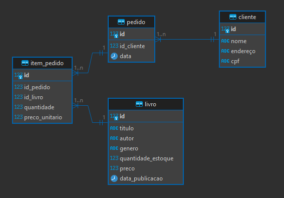

# FBD-Livraria
# Projeto de Sistema de Gestão para Livraria - API

Objetivo do Projeto:
Desenvolver um sistema de gestão para uma livraria, incluindo funcionalidades como gerenciamento de pedidos, livros e registro de clientes.

### O projeto inclui quatro tabelas no banco de dados:
  

### Foram utilizadas as seguintes tecnologias:
- Python
- Flask
- Psycopg2
- PostgreSQL
 
